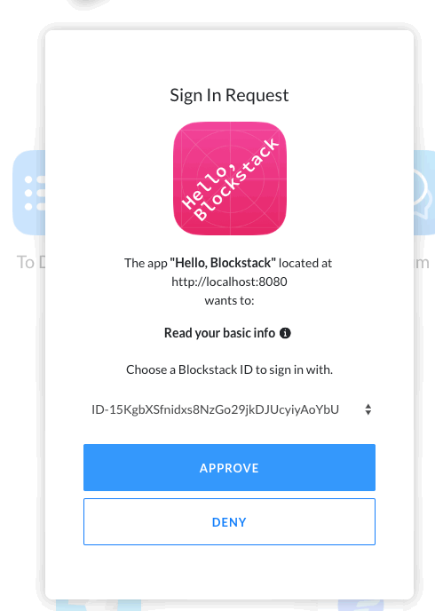

In this tutorial, you build and a single-page application (SPA) with Blockstack
and Vue.js. You take a tour through the applications' Blockstack functionality.
You'll learn how it manages authentiation using a Blockstack ID and how it
stores information associated with that ID using Blockstack Storage (Gaia).

The tutorial relies on both the `npm` and  the `yarn` package managers. Before you begin, verify
you have these tools `npm` using the `which` command to verify.

```bash
$ which npm
/usr/local/bin/npm
$ which yarn
/usr/local/bin/yarn
```

[Install npm](https://www.npmjs.com/get-npm), [install
yarn](https://yarnpkg.com/lang/en/docs/install/#mac-stable), or both as needed. You

Finally, make sure you have [created at least one Blockstack ID](ids-introduction.md#create-an-initial-blockstack-id). You'll use this ID to interact with the application.


## Install, build, and run the code

You can clone the source code with  `git` or [download and unzip the code from
the
repository](https://github.com/blockstack/blockstack-todos/archive/master.zip).
These instructions assume you are cloning.


1. Install the code by cloning it.

    ```
    $ git clone git@github.com:blockstack/blockstack-todos.git
    ```

2. Change to directory to the root of the code.

    ```
    $ cd blockstack-todos
    ```

2. Use yarn to install the dependencies.


    ```
    $ yarn install
    yarn install v1.9.2
    info No lockfile found.
    ...
    [4/5] 🔗  Linking dependencies...
    [5/5] 📃  Building fresh packages...
    success Saved lockfile.
    ✨  Done in 19.90s.
    ```
3. Start the application.

    ```
    $ npm run start
    ```

    You should see a simple application:

    

 4. Choose **Sign In with Blockstack**.

    The application detects whether the user has the Blockstack client edition installed or
    not. This is done automatically by the Blockstack API, more about this later.
    The next step depends on the users' current state.

    | Using web app    | Has client edition installed      |
    |------------------|-----------------------------------|
    |  |  |

    If the user has used the Blockstack authenticator but not reset it, the user can
    simply use the exiting identity.

    

    If the user chooses **Deny**, the Blockstack authenticator opens but the user
    is not logged into the sample application.

#### How Sign In works

As you click the `Sign In With Blockstack` button an _ephemeral key_ is generated within the application. A cryptographic key is called ephemeral if it is generated for each execution of a key establishment process. This key, which is just used for the particular instance of the application, is just used to sign a **Sign In** request. It also generates a public key which is sent to the browser and used to encrypt data coming back to your Blockstack node. This allows the application to store data in your Blockstack storage. The signed authentication request is sent to Blockstack through a JSON Web Token. The JWT is passed in via a query string in the parameter: `https://browser.blockstack.org/auth?authRequest=j902120cn829n1jnvoa...`.

To decode the token and see what information it holds you can navigate to [jwt.io](http://jwt.io/) and paste the full token there. The output should look similar to below:

```json
{
  "jti": "3i96e3ad-0626-4e32-a316-b243154212e2",
  "iat": 1533136622,
  "exp": 1533140228,
  "iss": "did:btc-addr:1Nh8oQTunbEQWjrL666HBx2qMc81puLmMt",
  "public_keys": [
    "0362173da080c6e1dec0653fa9a3eff5f5660546e387ce6c24u04a90c2fe1fdu73"
  ],
  "domain_name": "http://localhost:8080",
  "manifest_uri": "http://localhost:8080/manifest.json",
  "redirect_uri": "http://localhost:8080/",
  "version": "1.2.0",
  "do_not_include_profile": true,
  "supports_hub_url": true,
  "scopes": [
    "store_write"
  ]
}
```


Clicking the **Sign In** button brings up a modal. When you click `Approve` the following actions are taken:

- A request is sent from the browser to your local blockstack-core node.
- The blockstack-core node generates a session token which is returned to the application.
- This session token allows the application to read and write files to your personal Blockstack storage.
- An authentication response is then generated which is similar to the `authRequest` above.
- The `authResponse` also includes a private key intended only for the application. This allows the application to encrypt data on your storage.
- You are now logged into the Todo application!

##### Notes

- `iss` is a decentralized identifier or `did`. This is used to identify you, along with your name to the application. As you see here the particular `did` we are using is a `btc-addr`.
- The JWT implementation we use is different from other implementations because of the underlying cryptography we employ. There are libraries in [Javascript](https://github.com/blockstack/jsontokens-js) and [Ruby](https://github.com/blockstack/ruby-jwt-blockstack) available on the Blockstack Github to allow you to work with these tokens.

#### Storage - How it works

To see the Gaia Storage in action add a couple of todos. Maybe a list of applications you want to see built on top of Blockstack. I added the following:

- [ ] Software package manager secured by the blockchain
- [ ] Mutable torrents with human readable names
- [ ] Decentralized twitter

These Todos have now been stored in the Gaia Hub linked to your Blockstack ID. For more information about the Gaia hub, see the [hub repository](https://github.com/blockstack/gaia).

You can fetch the `todos.json` file you just added by opening the Javascript console and running the following command:

```Javascript
blockstack.getFile("todos.json", { decrypt: true }).then((file) => {console.log(file)})
```

You should see the todos that were recently added. The todos created above generate the following JSON:

```json
[
  {
    "id":2,
    "text":"Software package manager secured by the blockchain",
    "completed":false
  },
  {
    "id":1,
    "text":"Mutable torrents with human readable names",
    "completed":false
  },
  {
    "id":0,
    "text":"Decentralized twitter",
    "completed":false
  }
]
```
Now add another todo and mark it completed:

- [x] Blockstack Todo
- [ ] Software package manager secured by the blockchain
- [ ] Mutable torrents with human readable names
- [ ] Decentralized twitter

When you fetch the newly generated file using the Javascript console it will reflect the change:

```json
[
  {
    "id":3,
    "text":"Blockstack Todo",
    "completed":true
  },
  {
    "id":2,
    "text":"Software package manager secured by the blockchain",
    "completed":false
  },
  {
    "id":1,
    "text":"Mutable torrents with human readable names",
    "completed":false
  },
  {
    "id":0,
    "text":"Decentralized twitter",
    "completed":false
  }
]
```

Now that you have seen the application in action, lets dig into how it works. Open the `blockstack-todos` repository in a text editor.

#### Sign In - Implementation

Because this is a [Vue.js](https://vuejs.org/) application the **Sign In** code is in two locations. The first is a call in `src/components/Landing.vue`:

```js
signIn () {
  const blockstack = this.blockstack
  blockstack.redirectToSignIn()
}
```
When this button is clicked the authentication request described above is generated and the user is redirected to their `blockstack-browser` to approve the login. Once the user approves the login the application must handle the `authResponse`. This happens in `src/App.vue` which is the page at the application root, `/`:

```js
if (blockstack.isUserSignedIn()) {
  this.user = blockstack.loadUserData().profile
} else if (blockstack.isSignInPending()) {
  blockstack.handlePendingSignIn()
  .then((userData) => {
    window.location = window.location.origin
  })
}
```

First we check if the user is signed in with `blockstack.isUserSignedIn()`. If this is true then we can pull that data from the browser and use it in our application.

If we aren't signed in we then need to check `blockstack.isSignInPending()`. This means that an `authResponse` has been sent back to the application but hasn't been processed yet. the `handlePendingSignIn()` function takes care of processing that pending Sign In.

Signout is handled in `src/components/Dashboard.vue`. The method allows the application creator to decide where to redirect the user upon Sign Out:

```js
signOut () {
  this.blockstack.signUserOut(window.location.href)
}
```

## Implementing storage

Next we are going to see how the application interacts with your Gaia Hub. This code lives in the `src/components/Dashboard.vue` file. First lets see where the changes to the Todos are processed:

```js
todos: {
  handler: function (todos) {
    const blockstack = this.blockstack
    return blockstack.putFile(STORAGE_FILE, JSON.stringify(todos), { encrypt: true })
  },
  deep: true
}
```

You can see that the `todos` JSON object is passed in. Then we use the `blockstack.putFile()` method to store it in our Gaia Hub. Quick and easy!

The other operation we need to perform is to read the Todos from the storage. This is accomplished with the `blockstack.getFile()` method which returns a promise:

```js
fetchData () {
  const blockstack = this.blockstack
  blockstack.getFile(STORAGE_FILE, { decrypt: true })
  .then((todosText) => {
    var todos = JSON.parse(todosText || '[]')
    todos.forEach(function (todo, index) {
      todo.id = index
    })
    this.uidCount = todos.length
    this.todos = todos
  })
},
```

The `todos` data is retrieved from the promise.

You now have everything you need to construct complex applications complete with Authentication and Storage on the Decentralized Internet. Go forth and build!
